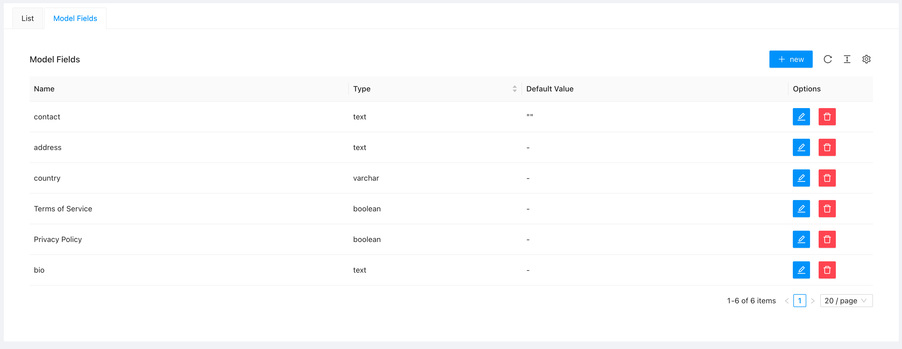
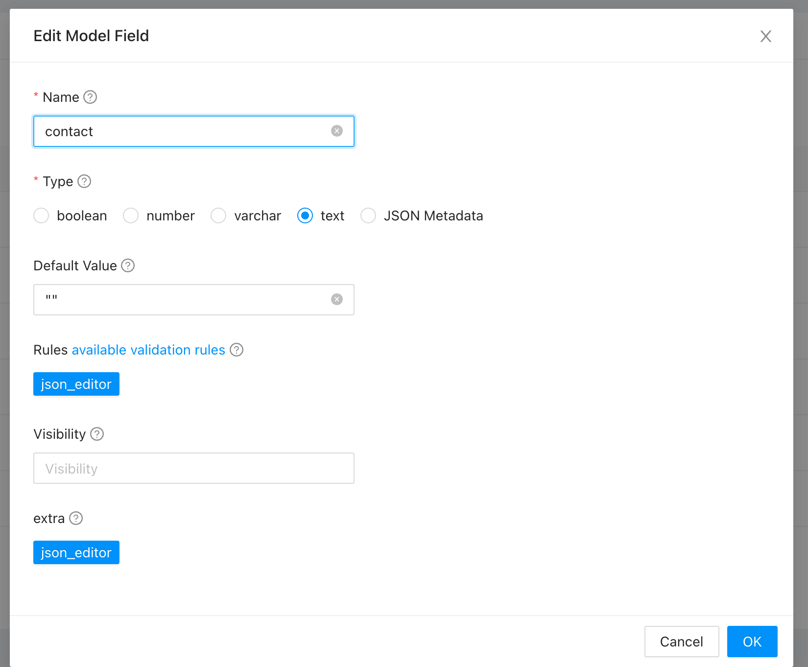

# Model Fields

[](https://escolalms.github.io/model-fields/)
[](https://codecov.io/gh/EscolaLMS/model-fields)
[](https://github.com/EscolaLMS/model-fields/actions/workflows/test.yml)
[](https://packagist.org/packages/escolalms/model-fields)
[](https://packagist.org/packages/escolalms/model-fields)
[](https://packagist.org/packages/escolalms/model-fields)
[](https://codeclimate.com/github/EscolaLMS/model-fields/maintainability)
[](https://codeclimate.com/github/EscolaLMS/model-fields/test_coverage)

## What does it do

This package allows you to add unlimited extra primitive fields to any model.

Types of fields that can be user

- booleandoc
- number
- varchar
- text
- json

Details documentation is provided as an example

## Installing

- `composer require escolalms/model-fields`
- `php artisan migrate`
- `php artisan db:seed --class="EscolaLms\ModelFields\Database\Seeders\PermissionTableSeeder"`

## Database

The package allows to add additional fields by creating special meta description values that are saved in database.

Next to metadata descriptions there are values that works with the meta description.

Below are examples of how matadata and values are stored in database

`model_fields_metadata` table sample rows

|  id  |     created_at      |     updated_at      |        name         |  type   |              rules              | extra |   default   |               class_type                | visibility |
| :--: | :-----------------: | :-----------------: | :-----------------: | :-----: | :-----------------------------: | :---: | :---------: | :-------------------------------------: | :--------: |
| 2147 | 2022-03-03 12:10:05 | 2022-03-03 12:10:05 |     description     |  text   | ["required","string","max:255"] | NULL  | lorem ipsum | EscolaLms\ModelFields\Tests\Models\User |     1      |
| 2148 | 2022-03-03 12:10:05 | 2022-03-03 12:10:05 | interested_in_tests | boolean |     ["required","boolean"]      | NULL  |      1      | EscolaLms\ModelFields\Tests\Models\User |     1      |
| 2149 | 2022-03-03 12:10:05 | 2022-03-03 12:10:05 |        title        | varchar | ["required","string","max:255"] | NULL  |             | EscolaLms\ModelFields\Tests\Models\User |     1      |
| 2150 | 2022-03-03 12:10:05 | 2022-03-03 12:10:05 |      consents       |  json   |       ["required","json"]       | NULL  |     []      | EscolaLms\ModelFields\Tests\Models\User |     1      |
| 2151 | 2022-03-03 12:10:05 | 2022-03-03 12:10:05 |    extra_points     | number  |     ["required","integer"]      | NULL  |     123     | EscolaLms\ModelFields\Tests\Models\User |     1      |
| 2153 | 2022-03-03 12:11:05 | 2022-03-03 12:11:05 |  extra_description  |  text   | ["required","string","max:255"] | NULL  | lorem ipsum | EscolaLms\ModelFields\Tests\Models\User |     1      |

`model_fields_values` table sample rows

|  id  |     created_at      |     updated_at      |        name         |               value                |               class_type                | class_id |
| :--: | :-----------------: | :-----------------: | :-----------------: | :--------------------------------: | :-------------------------------------: | :------: |
| 1432 | 2022-03-03 12:17:42 | 2022-03-03 12:17:42 |      consents       | {"consent1":true,"consent2":false} | EscolaLms\ModelFields\Tests\Models\User |   1458   |
| 1433 | 2022-03-03 12:17:42 | 2022-03-03 12:17:42 |    extra_points     |                1000                | EscolaLms\ModelFields\Tests\Models\User |   1458   |
| 1436 | 2022-03-03 12:17:42 | 2022-03-03 12:17:42 |     description     |                zzz                 | EscolaLms\ModelFields\Tests\Models\User |   1458   |
| 1438 | 2022-03-03 12:17:42 | 2022-03-03 12:17:42 | interested_in_tests |                true                | EscolaLms\ModelFields\Tests\Models\User |   1458   |

See [tests](tests) folder as rows above are generated from the tests.

## Example

The best documentation operates on live example so here it is.

Assuming you have User Model

```php
use Illuminate\Database\Eloquent\Model;

class User extends Model
{
    protected $table = 'users';
    protected $fillable = ['first_name', 'last_name', 'email'];
    protected $appends = ['foo'];
    public function getFooAttribute()
    {
        return 'bar';
    }
}

```

In order to add extra fields to user model you would need to create new columns in user table with migration and add those fields.
This is a standard way of handling this issue, but this package introduces new one.

### Option 1. Extending Model

This option replaces `Illuminate\Database\Eloquent\Model` with `EscolaLms\ModelFields\Models\Model`

```php
use EscolaLms\ModelFields\Models\Model;

class User extends Model
{
    protected $table = 'users';
    protected $fillable = ['first_name', 'last_name', 'email'];
    protected $appends = ['foo'];
    public function getFooAttribute()
    {
        return 'bar';
    }
}
```

### Option 2. Trait in Model.

This option uses `EscolaLms\ModelFields\Traits\ModelFields` instead of extending class;

```php
use Illuminate\Database\Eloquent\Model;
use EscolaLms\ModelFields\Traits\ModelFields;

class User extends Model
{
    use ModelFields;

    protected $table = 'users';
    protected $fillable = ['first_name', 'last_name', 'email'];
    protected $appends = ['foo'];
    public function getFooAttribute()
    {
        return 'bar';
    }
}

}
```

Basically that all the steps you need to allow model to be extendable.

### Defining new fields on selected Model.

Now lets create new field meta description. We'll be adding new field to user, called `description` which will be long text.

```php

use EscolaLms\ModelFields\Facades\ModelFields;

ModelFields::addOrUpdateMetadataField(
    User::class, // Model class that we want to extents
    'description', // name of new field
    'text', // type of new field
    'lorem ipsum', // default value
    ['required', 'string', 'max:255'] // validation rules
);
```

Interface of this method is as follows

```php
use EscolaLms\ModelFields\Models\Metadata;

public function addOrUpdateMetadataField(string $class_type, string $name, string $type, string $default = '', array $rules = null, $visibility = 1 << 0): Metadata;


```

Once new field is added you can use is as any other attribute of model

```php
$extraAttributes = [
    'description' => 'to be or not to be',
];


$user = User::create(array_merge([
    'first_name' => 'John',
    'last_name' => 'Deo',
    'email' => 'john@email.com',
], $extraAttributes));

$user = User::find($user->id);

assert($user->description === $extraAttributes['description']);
```

That's all, your user model is ready to be extended. You can get and set attributes as they were created standard way.

```php
 $extraAttributes = [
    'description' => 'aaa',
    'interested_in_tests' => false,
    'aaaa' => 'aaaa', // this will not be saved as is neither in model attributes nor in extra fields
    'consents' => ['consent1' => true, 'consent2' => false]
];

$user = User::create(array_merge([
    'first_name' => 'aaa',
    'last_name' => 'aaa',
    'email' => 'aaa@email.com',
], $extraAttributes));

$user->fill(['a' => 'nb']);  // this will not be saved as is neither in model attributes nor in extra fields

$user = User::find($user->id); // fetch user from database

assert($user->description === $extraAttributes['description']);
assert($user->interested_in_tests === $extraAttributes['interested_in_tests']);
assert($user->consents === $extraAttributes['consents']);
assert($user->aaaa === null);

$user->description = 'abc';
$user->interested_in_tests = true;
$user->save();

$user = User::find($user->id); // fetch user from database

assert($user->description === 'abc');
assert($user->interested_in_tests === true);

$user->update([
    'description' => 'zzz',
    'interested_in_tests' => false
]);

$user = User::find($user->id);  // fetch user from database

assert($user->description === 'zzz');
assert($user->interested_in_tests === false);
```

### Resources and fields visibility

Using resources is simple, look at the following example

```php
namespace EscolaLms\ModelFields\Tests\Http\Resources;

use Illuminate\Http\Resources\Json\JsonResource;
use EscolaLms\ModelFields\Tests\Models\User;
use EscolaLms\ModelFields\Facades\ModelFields;
use EscolaLms\ModelFields\Enum\MetaFieldVisibilityEnum;

class UserResource extends JsonResource
{
    public function __construct(User $user)
    {
        $this->user = $user;
    }

    public function toArray($request)
    {
        return [
            'id' => $this->user->id,
            'first_name' => $this->user->first_name,
            'last_name'  => $this->user->last_name,
            'email' => $this->user->email,
            ...ModelFields::getExtraAttributesValues($this->user, MetaFieldVisibilityEnum::PUBLIC) //  MetaFieldVisibilityEnum::PUBLIC === 1
        ];
    }
}

```

Note. In php 7.4 user `array_merge` instead of spread `...` operator.

Look at the visibility field in example above. Package allows to define visibility of the meta fields. Here we're defining 2 fields, one is public, second admin only.

```php

use EscolaLms\ModelFields\Facades\ModelFields;
use EscolaLms\ModelFields\Facades\ModelFields;

ModelFields::addOrUpdateMetadataField(
    User::class,
    'title',
    'varchar',
    '',
    ['required', 'string', 'max:255']
);

ModelFields::addOrUpdateMetadataField(
    User::class,
    'admin_secret',
    'varchar',
    'super_secret',
    ['required', 'string', 'max:255'],
    MetaFieldVisibilityEnum::ADMIN
);

```

Now we can have 2 endpoints one that list user with public fields, other with visible to admin only.

```php
namespace EscolaLms\ModelFields\Tests\Http\Resources;

use Illuminate\Http\Resources\Json\JsonResource;
use EscolaLms\ModelFields\Tests\Models\User;
use EscolaLms\ModelFields\Facades\ModelFields;
use EscolaLms\ModelFields\Enum\MetaFieldVisibilityEnum;

class UserResource extends JsonResource
{
    public function __construct(User $user)
    {
        $this->user = $user;
    }

    public function toArray($request)
    {
        return [
            'first_name' => $this->user->first_name,
            'last_name'  => $this->user->last_name,
            'email' => $this->user->email,
            ...ModelFields::getExtraAttributesValues($this->user, MetaFieldVisibilityEnum::PUBLIC)
        ];
    }
}

```

Now let's see how Admin Resource would look like.

```php
namespace EscolaLms\ModelFields\Tests\Http\Resources;

use Illuminate\Http\Resources\Json\JsonResource;
use EscolaLms\ModelFields\Tests\Models\User;
use EscolaLms\ModelFields\Facades\ModelFields;
use EscolaLms\ModelFields\Enum\MetaFieldVisibilityEnum;

class UserAdminResource extends JsonResource
{
    public function __construct(User $user)
    {
        $this->user = $user;
    }

    public function toArray($request)
    {
        return [
            'id' => $this->user->id,
            'first_name' => $this->user->first_name,
            'last_name'  => $this->user->last_name,
            'email' => $this->user->email,
            ...ModelFields::getExtraAttributesValues($this->user, MetaFieldVisibilityEnum::ADMIN | MetaFieldVisibilityEnum::PUBLIC)
        ];
    }
}

```

`MetaFieldVisibilityEnum::ADMIN | MetaFieldVisibilityEnum::PUBLIC` is a [Flagged/Bitwise Enum](https://github.com/BenSampo/laravel-enum#flaggedbitwise-enum). `MetaFieldVisibilityEnum` is just a proposal - you can use as many permissions as you like yet defining values you must use powers of 2, like.

```php
    const ReadComments      = 1 << 0;
    const WriteComments     = 1 << 1;
    const EditComments      = 1 << 2;
    const DeleteComments    = 1 << 3;
```

### Validation with `FormRequest`

Example below describes how to fetch validation rules from MetaField

```php
namespace EscolaLms\ModelFields\Tests\Http\Requests;

use EscolaLms\ModelFields\Tests\Models\User;

use Illuminate\Foundation\Http\FormRequest;
use EscolaLms\ModelFields\Facades\ModelFields;

class UserCreateRequest extends FormRequest
{
    /**
     * @return bool
     */
    public function authorize()
    {
        return true;
    }

    /**
     * Get the validation rules that apply to the request.
     *
     * @return array
     */
    public function rules()
    {
        return [
            'first_name' => ['required', 'string'],
            'last_name' => ['required', 'string'],
            'email' => ['required', 'unique:users'],
            ...ModelFields::getFieldsMetadataRules(User::class)
        ];
    }
}
```

In php 7.4 user `array_merge` instead of spread `...` operator.

## Endpoints

All the endpoints are defined in [](https://escolalms.github.io/model-fields/).

## Tests

Run `./vendor/bin/phpunit` to run tests. See [tests](tests) folder as it's quite good staring point as documentation appendix.

Test details [](https://codecov.io/gh/EscolaLMS/model-fields) [](https://github.com/EscolaLMS/model-fields/actions/workflows/test.yml)

## Events

This package does not dispatch any events.

## Listeners

This package does not listen for any events

## How to use this on frontend.

### Admin panel

All the endpoints defined in [](https://escolalms.github.io/model-fields/) are for admin panel.

There is native component you can use to implement this in [admin panel](https://github.com/EscolaLMS/Admin/tree/main/src/components/ModelFields) for any model that allows extending

```jsx
<ModelFields class_type="EscolaLms\Auth\Models\User" />
```

Example in admin panel

**List of user model fields**



**Creating/editing model field**



### Front Application

See example above how to extend controllers to CRUD model fields to give model

## Permissions

Permissions are defined in [seeder](packages/model-fields/database/seeders/PermissionTableSeeder.php)

## Roadmap. Todo. Troubleshooting.

- `firstOrCreate` doesn't work when passing extra attributes
